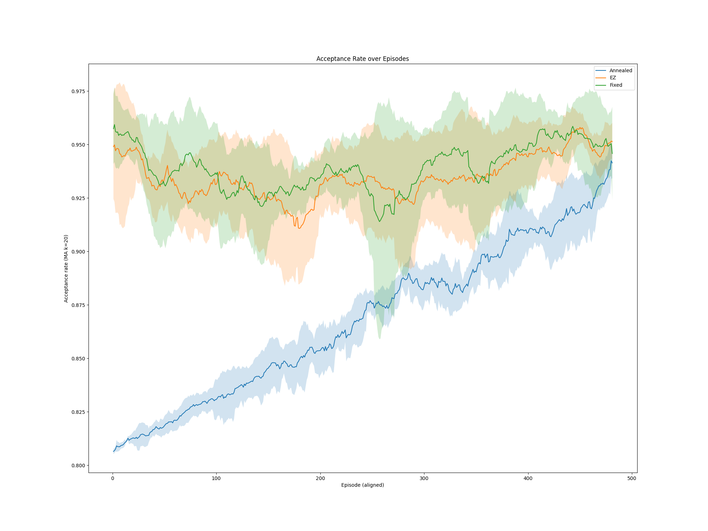
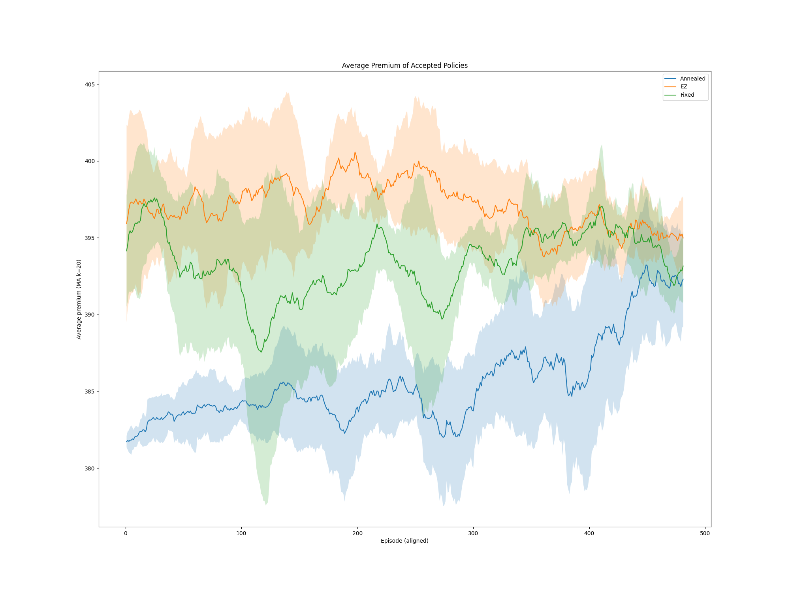
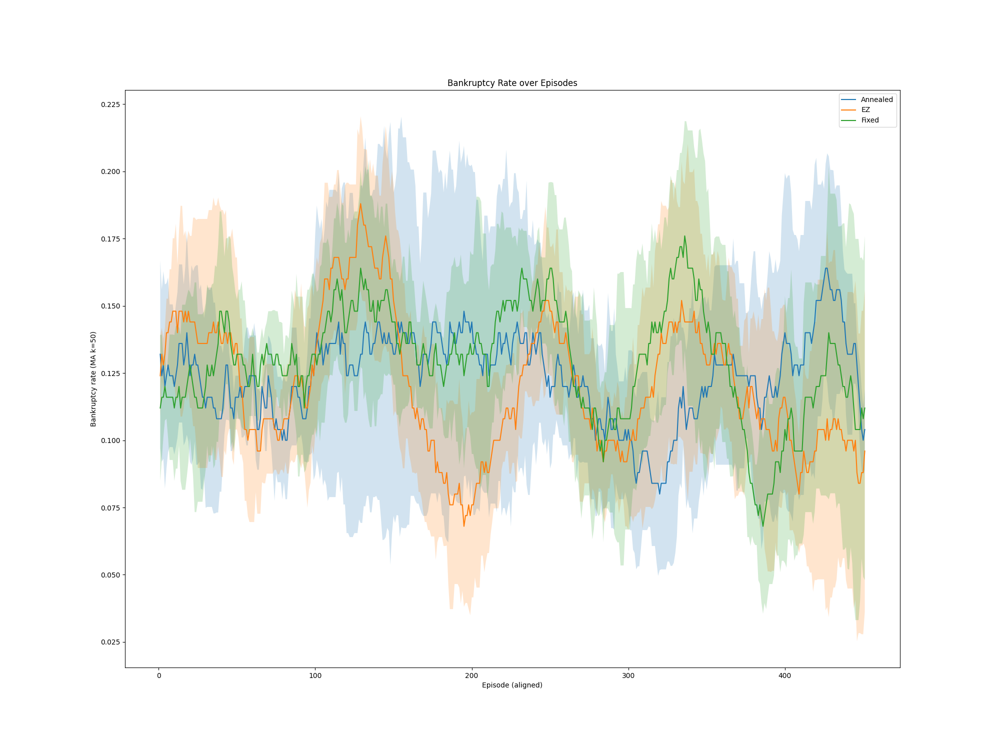
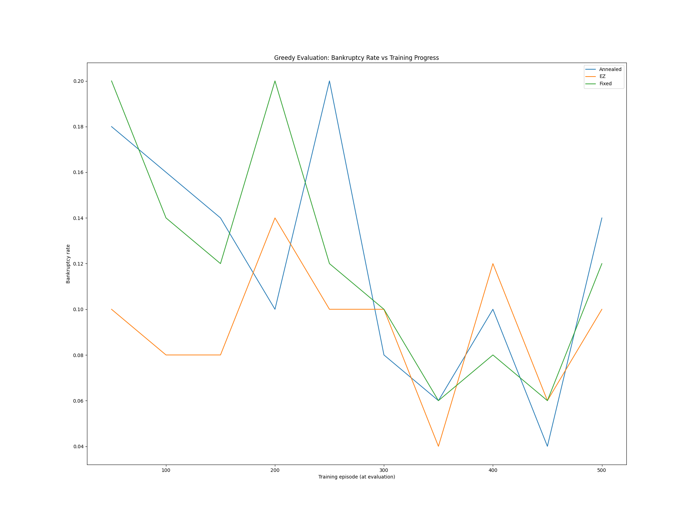
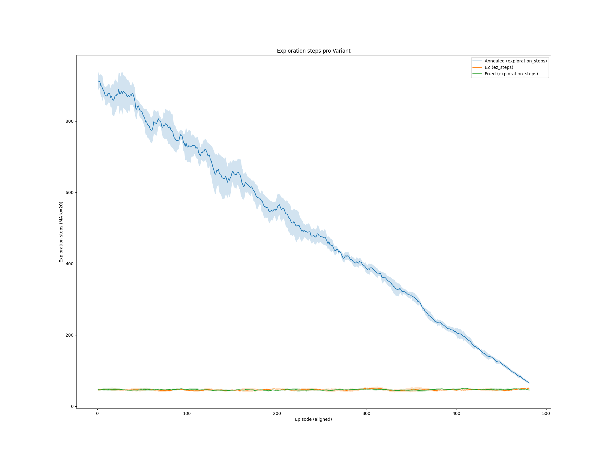
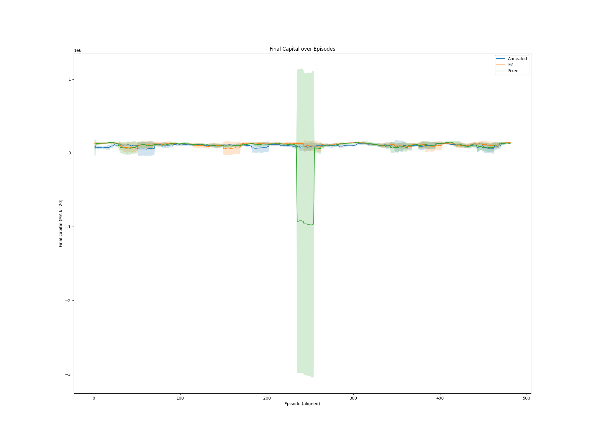
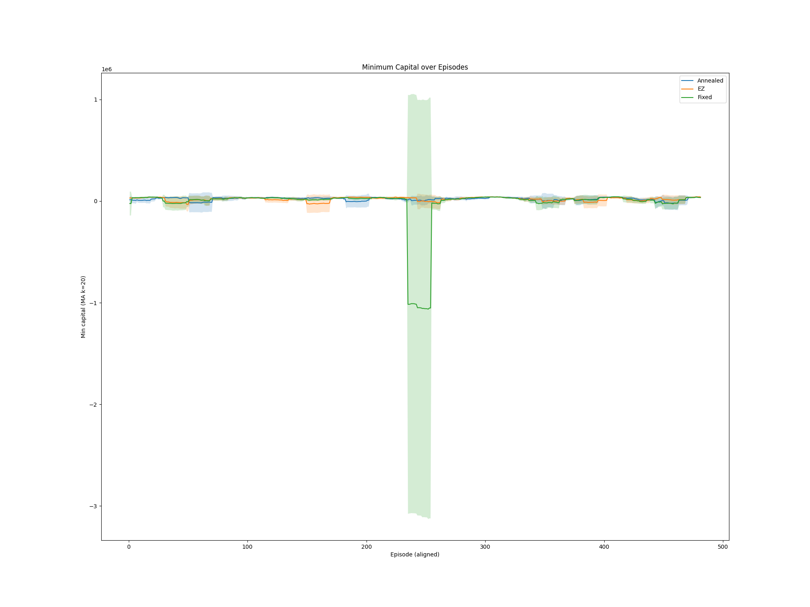
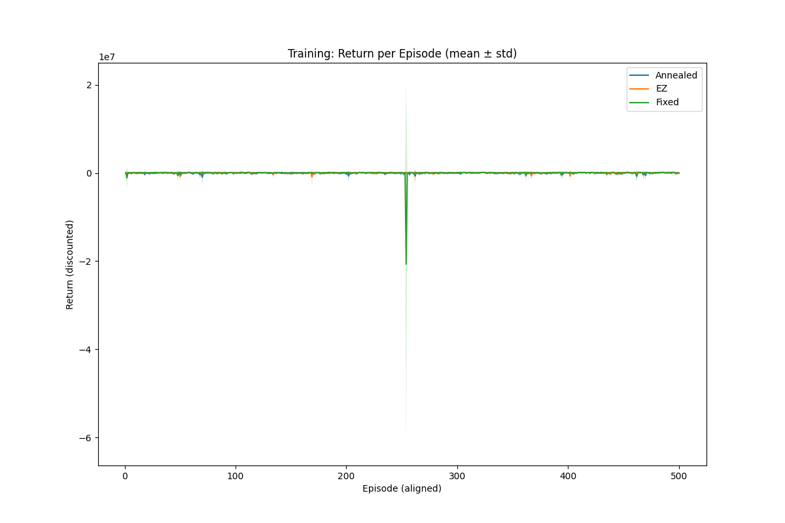
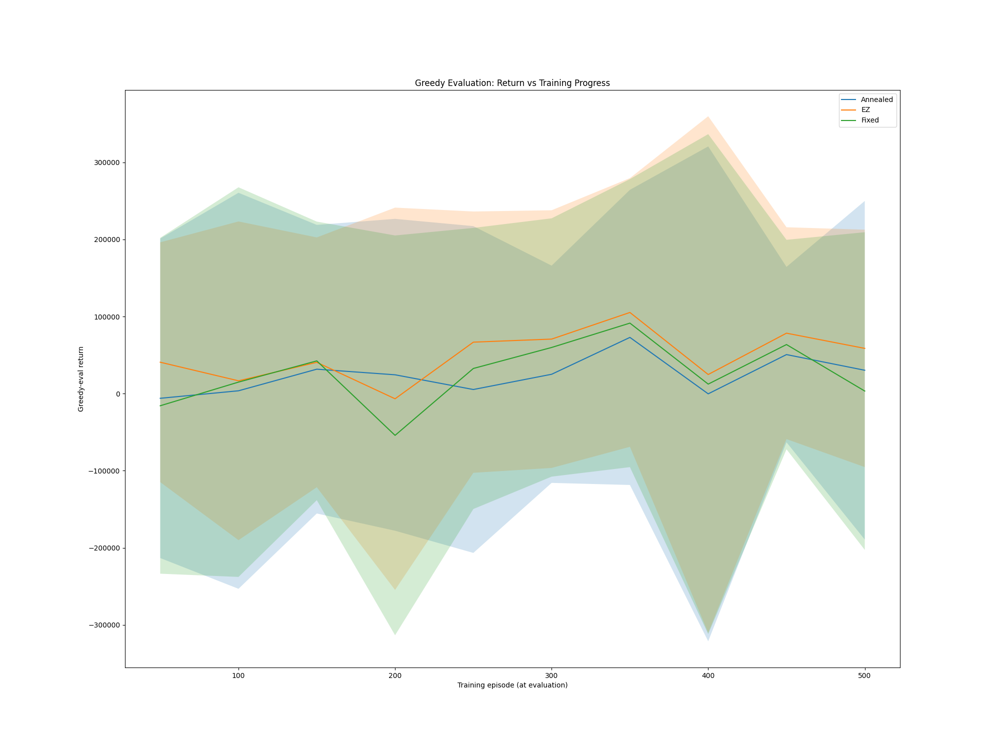

# Ausführliche Auswertung der Trainings- und Evaluationsplots

Diese Datei beschreibt und **begründet** die wichtigsten Erkenntnisse aus den bereitgestellten Plots einer DQN‑basierten Preis-/Annahmepolitik in einer Versicherungs‑Gym‑Umgebung. Verglichen werden drei **Explorationsstrategien**:
- **Annealed ε-greedy** (lineares Absenken von ε)
- **EZ-greedy** (konstante, aber „strukturierte“ Exploration – in den Plots als *EZ* geführt)
- **Fixed-ε** (starrer ε‑Wert)

Zur Lesbarkeit werden nach jedem Plot **Beobachtungen**, **Interpretation/Begründung** und **Implikationen** getrennt dargestellt.

---

## 1) Acceptance Rate über Episoden

**Beobachtungen**
- **Annealed (blau)**: monotone Steigerung der Acceptance von ca. **0.81 → ~0.94–0.95** über ~500 Episoden.
- **EZ (orange)** und **Fixed (grün)**: starten hoch (**~0.95**) und verbleiben in **~0.92–0.96** mit wellenförmigen Schwankungen.
- Gegen Ende konvergieren alle drei Strategien auf ein ähnlich hohes Niveau.

**Mögliche Interpretation & Begründung**
- Die **steigende Kurve unter Annealed** passt zu der Erwartung, dass anfangs viel exploriert wird (mehr suboptimale Angebote/Entscheidungen → geringere Acceptance), und mit sinkendem ε die **Ausnutzung** („exploitation“) überwiegt → **bessere Angebots-/Preisentscheidungen** → höhere Acceptance.
- Die **hohe Start‑Acceptance** bei **EZ/Fixed** deutet darauf hin, dass diese Strategien **von Beginn an weniger explorieren** und damit **konservativere Entscheidungen** treffen, die öfter angenommen werden – allerdings mit geringerem Lernschub am Anfang.
- Die **Wellen** sprechen für **Regime-/Störschwankungen** im Environment (z. B. wechselnde Anspruchshäufigkeiten oder Nachfrage), die alle Strategien ähnlich treffen.

**Implikationen**
- **Annealed** liefert ein **verlässliches Lernsignal**: klare, kontinuierliche Verbesserung.
- **EZ/Fixed** sind in Bezug auf Acceptance **sofort gut**, verbessern sich aber weniger sichtbar über die Zeit.

---

## 2) Durchschnittsprämie akzeptierter Policen (Training)

**Beobachtungen**
- **EZ** erzielt über weite Strecken die **höchsten durchschnittlichen akzeptierten Prämien** (**~398–401** zu Beginn, später **~395–398**).
- **Fixed** zeigt einen **tiefen Dip** um **Ep. ~150–200**, erholt sich danach auf **~395–397**.
- **Annealed** startet am niedrigsten (**~382**) und **steigt stetig** Richtung **~392–395**.

**Mögliche Interpretation & Begründung**
- **EZ** kombiniert eine **konstante, aber nicht übermäßige Exploration** mit starker **Ausnutzung** profitabler Preisbereiche – dadurch **höhere Preise**, ohne die Acceptance stark einzubüßen (siehe Plot 1).
- Der **Dip bei Fixed** legt nahe, dass die starre Exploration zu **falschen Preisregionen** geführt hat (z. B. vorübergehend zu niedrige/zu hohe Preisangebote, die Akzeptanz/Risiko ungünstig verschieben).
- **Annealed** benötigt anfangs Exploration (niedrigere Premiums), **konvergiert aber** zu konkurrenzfähigen Werten – konsistent mit der Lernkurve aus Plot 1.

**Implikationen**
- Für **Umsatz/Ertrag pro Police** ist **EZ** vorn.
- **Annealed** holt auf und ist **stabil** – sinnvoll, wenn Robustheit wichtiger ist als maximale Prämien.
- **Fixed** ist **inkonsistenter** und potenziell fehleranfällig (siehe auch Kapital-/Return‑Plots).

---

## 3) Insolvenzrate – Training (MA k=50)

**Beobachtungen**
- Alle Strategien schwanken grob zwischen **~6 % und ~20 %**.
- **Periodische Wellen** sind sichtbar (mehrfaches Auf und Ab über die Episoden).
- **Annealed** zeigt tendenziell die **stärkste Abnahme** gegen Ende endet aber nicht mit dem besten Ergebnis.

**Mögliche Interpretation & Begründung**
- Die Bandbreite deutet auf **Stochastik/Regimewechsel** im Environment hin (z. B. Schaden-Cluster). Das erklärt die **Synchronität** der Wellen über Strategien hinweg.
- **Annealed** profitiert vom sauberen **Exploration→Exploitation‑Übergang**, wodurch **riskante Aktionen** sukzessive vermieden werden – das **senkt** die Insolvenzrate **nachhaltig**.
- **EZ/Fixed** reagieren weniger adaptiv, da ihre Exploration **kaum/gar nicht** mit dem Trainingsfortschritt mitwächst bzw. abnimmt.

**Implikationen**
- Für **Risikokontrolle** ist **Annealed** im Training die **sicherste Wahl**.

---

## 4) Insolvenzrate – Greedy‑Evaluation

**Beobachtungen**
- In der **greedy** (d. h. **ohne Exploration**) Auswertung liegt die Insolvenzrate ab ~ Episode 300 zwischen **~4 % und ~14 %**.
- **Annealed** erreicht **Tiefstwerte ~4–6 %** gegen **Ep. 400–450**.
- **Kein absoluter, durchgängiger Sieger**, aber **Annealed** zeigt die **klarste Verbesserung** im Verlauf.

**Mögliche Interpretation & Begründung**
- Die greedy‑Evaluation misst **reine Policy‑Qualität**. Dass **Annealed** hier deutlich fällt, bestätigt, dass die **gelernten Q‑Werte** stabil „exploitable“ sind.
- **EZ** performt ähnlich gut, aber **volatiler**, was zur Preis‑/Return‑Varianz (Plots 2 & 8) passt.
- **Fixed** ist im Mittel ok, aber **ohne klaren Abwärtstrend** – konsistent mit den Kapitalsprüngen (Plot 6/7).

**Implikationen**
- **Policy‑Reife** ist unter **Annealed** am besten sichtbar; **EZ** ist zweitstärkster Kandidat, aber riskanter.

---

## 5) Explorationsschritte pro Variante

**Beobachtungen**
- **Annealed** startet mit **sehr vielen** Explorationen und fährt diese **linear** herunter.
- **EZ** und **Fixed** verbleiben **nahezu konstant niedrig** über das gesamte Training.

**Mögliche Interpretation & Begründung**
- Das ist **idealtypisches Verhalten** für annealed ε‑greedy: Erst **breite Zustands-/Aktionsabdeckung**, dann **Fokussierung** auf erfolgreiche Muster.
- Dass **EZ** trotz **weniger Exploration** gute Werte erzielt, spricht für eine **gute Start-Policy** oder **strukturierte Entscheidung** (z. B. feste Heuristiken/Preisanker), die **schnell verwertbar** ist.
- **Fixed** exploriert nicht adaptiv → **höheres Risiko**, in suboptimalen Regionen hängen zu bleiben (spiegelt sich in Kapitalsprüngen).

**Implikationen**
- **Annealed** bietet die **beste Balance** zwischen **Lernen** (früh) und **Stabilität** (spät).
- **EZ** kann sich lohnen, wenn **schnelle Performance** wichtiger ist als tiefe Exploration.

---

## 6) Finales Kapital über Episoden (Training)

**Beobachtungen**
- **Fixed** zeigt einen **massiven Drawdown** um **Ep. ~240–270**, weit ins **Negative**.
- **Annealed** und **EZ** bleiben **nahe Null** (mit üblichen Schwankungen).

**Mögliche Interpretation & Begründung**
- Der Drawdown unter **Fixed** ist konsistent mit **starrer Exploration**: Trifft die Policy in einem **ungünstigen Regime** auf **feste** Explorationswahrscheinlichkeiten, können **Fehlentscheidungen akkumulieren** (z. B. falsche Preis-/Annahme-Trade‑offs), was **Kapital massiv belastet**.
- Da die anderen Strategien **stabil** bleiben, ist ein **Implementationsfehler** eher unwahrscheinlich; es spricht für eine **Strategie‑/Risikointeraktion**.

**Implikationen**
- **Fixed‑ε** ist in der vorliegenden Konfiguration **nicht produktionsreif**.
- **Annealed**/**EZ** sind **robuster** gegenüber Regimesprüngen.

---

## 7) Minimales Kapital über Episoden (Training)

**Beobachtungen**
- Der **gleiche Einbruch** wie bei **Final Capital** ist unter **Fixed** zu sehen.
- **Annealed**/**EZ** zeigen **keine katastrophalen Tiefpunkte**.

**Mögliche Interpretation & Begründung**
- Bestätigt, dass der Drawdown **kein Rendering-/Skalenartefakt** ist, sondern **tatsächliches Risikoereignis** (z. B. Cluster hoher Schadenszahlungen bei unpassender Pricing-/Annahmepolitik).

**Implikationen**
- **Risikomanagement** unter **Fixed** unzureichend. **Annealed/EZ** deutlich robuster.

---

## 8) Return pro Episode – Training

**Beobachtungen**
- Alle drei Strategien **oszillieren** stark **um 0** (hohe Volatilität).
- Ein **extremer Negativ‑Spike** (wieder **Fixed**) um **Ep. ~240–270**.

**Mögliche Interpretation & Begründung**
- Die **Return‑Volatilität** passt zu **stochastischen Rewards** (z. B. seltene hohe Schäden).
- Der **Spike** ist konsistent mit dem **Kapital‑Drawdown** – die Policy hat in dieser Phase **systematisch schlechte Entscheidungen** getroffen.

**Implikationen**
- **Fixed** ist **riskant**; **Annealed/EZ** sind **kontrollierter**, wenngleich volatil.

---

## 9) Return – Greedy‑Evaluation

**Beobachtungen**
- Der greedy‑Return zeigt einen **aufwärts gerichteten Trend** im Mittel.
- **EZ** erreicht **wiederholt die höchsten Peaks** (**~300–350k**), jedoch mit **großer Varianz**.
- **Annealed** liegt **knapp darunter**, wirkt **stabiler**.
- **Fixed** **unterperformt** und zeigt **größere Risiken** (breite Streuung).

**Mögliche Interpretation & Begründung**
- In der greedy‑Eval werden **keine Explorationsschritte** ausgeführt → Messung der **Policy‑Qualität ohne Zufallssprünge**. Dass **EZ** die höchsten Returns erzielt, passt zu den **höheren akzeptierten Prämien** (Plot 2) bei **vergleichbarer Acceptance** (Plot 1).
- **Annealed** liefert **robuste Returns** mit **geringerem Risiko** (vgl. Insolvenz/Kapital).

**Implikationen**
- **Ziel „max. Ertrag“ → EZ**, **Ziel „robuste Performance“ → Annealed**.
- **Fixed** aktuell **nicht empfehlenswert**.

---

## Gesamtfazit
- **EZ-greedy**: **Beste Erträge/Prämien**, jedoch **höhere Varianz** → geeignet, wenn **Profit** Priorität hat und **Risikoschwankungen** tolerierbar sind.
- **Annealed ε-greedy**: **Stetiges Lernen**, **sinkende Insolvenz**, **keine Katastrophen** → **robust** und **empfehlenswert** für **risikobewusste** Einstellungen.
- **Fixed‑ε**: **Instabil** durch **Drawdown** und **Extrem‑Returns** → in der aktuellen Form **nicht produktionsreif**.

---

## Empfehlungen (begründe Maßnahmen mit Befunden)
1. **Fixed debuggen** (Plots 6–8): Seeds/Logs in **Ep. 240–270** prüfen; Kapital‑Update, Reward‑Clipping, Konfiguration des ε‑Werts verifizieren. → Ziel: Ursache des Drawdowns identifizieren.
2. **Mehr Seeds/Konfidenz** (alle Plots): Bänder wirken **seed‑sensitiv**; **≥20 Seeds** für robuste Aussagen. → Ziel: Stabilität der Befunde statistisch absichern.
3. **Fairer Vergleich** (Plots 1–5): **Gleicher ε‑Floor** für Annealed/Fixed; bei **EZ** **k‑Parameter** und ε feinjustieren. → Ziel: Bias durch ungleiche Exploration vermeiden.
4. **Robustheit erhöhen** (Kapital/Returns/Bankruptcy): **Double‑DQN**, **Target‑Soft‑Updates**, **Gradient‑Clipping**, **Prioritized Replay** evaluieren. → Ziel: Varianz dämpfen, Overestimation reduzieren.
5. **Risikometriken ergänzen** (Bankruptcy/Kapital): **CVaR/Expected Shortfall**, Insolvenzhäufigkeit pro Regime, **Profit per accepted policy** reporten. → Ziel: Entscheidungen entlang Risiko‑/Ertrag‑Profil steuern.

---

### Anhang: Dateiübersicht
- `AcceptanceRate.png`
- `Average_premium_training.png`
- `BankruptcyRate_evaluation.png`
- `BankruptcyRate_training.png`
- `ExplorationSteps.png`
- `FinalCapital_over_episodes_training.png`
- `MinimumCapital_over_episodes_training.png`
- `Return_per_episode_evaluation.png`
- `Return_per_episode_training.png`
