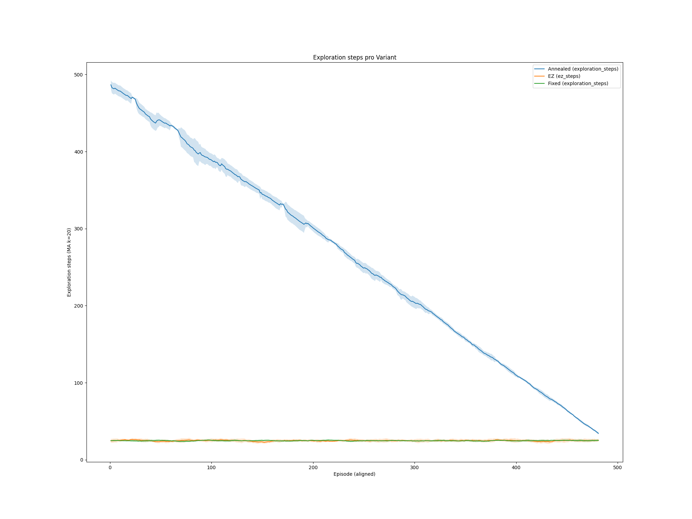

# Ausführliche Auswertung – NEUE Plots (alte Ergebnisse ignoriert)
*Erstellt am 11.08.2025 19:31*

Diese Markdown-Datei fasst **ausschließlich** die neu bereitgestellten Plots zusammen (vorherige Ergebnisse werden ignoriert). Verglichen werden drei Varianten:
- **Annealed ε-greedy** (ε linear abgesenkt)
- **EZ-greedy** (konstante, aber strukturierte Exploration)
- **Fixed-ε** (starrer ε-Wert)

Für jeden Plot: **Beobachtungen → Begründete Interpretation → Implikationen**.

---

## 1) Acceptance Rate über Episoden

**Beobachtungen**
- **Annealed (blau)**: klare, fast lineare **Steigerung** von ~0.80 auf ~0.94; **gegen Ende** (≈ Ep. 430+) **größere Varianz** und ein temporärer Rückgang (einige Runs fallen deutlich ab), danach Wiederanstieg.
- **EZ (orange)**: **sehr hohe Acceptance** schon zu Beginn (~0.97–0.99) mit leichtem **Abwärtstrend** über das Training.
- **Fixed (grün)**: startet **am höchsten** (~0.99), zeigt aber einen **langsamen Drift nach unten**.

**Interpretation (Begründung)**
- **Annealed**: viel Exploration am Anfang → mehr suboptimale Angebote → niedrigere Acceptance; mit sinkendem ε wandelt sich das in **Ausnutzung** → **kontinuierliche Verbesserung**. Der späte **Varianzanstieg** deutet auf **sensitivere Policy-Regionen** oder **Regimewechsel** im Environment hin, die manche Seeds stärker treffen.
- **EZ/Fixed**: weniger/konstante Exploration begünstigt **sofort „sichere“ Entscheidungen** (hohe Acceptance), aber **langsameres Lernen**; der **Abwärtsdrift** kann bedeuten, dass die Policies **konservativer** werden (z. B. höhere Preise oder restriktivere Annahmen), was später **etwas Acceptance kostet**.

**Implikationen**
- **Annealed**: gute Wahl, wenn **nachhaltige Lernkurve** gewünscht ist; späte Instabilität beobachten.
- **EZ/Fixed**: **sofort hohe Acceptance**, aber langfristig **leicht erodierend** – Kalibrierung (ε oder Preisheuristik) prüfen.

---

## 2) Durchschnittsprämie akzeptierter Policen (Training)

**Beobachtungen**
- **EZ (orange)** und **Fixed (grün)**: beginnen **hoch** (≈ 398–405) und **nehmen über die Zeit ab** (≈ 391–393 am Ende).
- **Annealed (blau)**: startet **niedrig** (≈ 382), **steigt bis ~389–390**, fällt um ≈ Ep. 430 **deutlich ab** und **erholt** sich zum Ende wieder (≈ 387–389).

**Interpretation (Begründung)**
- **EZ/Fixed**: die Kombination aus **hoher Acceptance** (Plot 1) und **sinken­der Prämie** legt nahe, dass die Policies **preislich konservativer** werden, um Akzeptanz zu sichern. Das kann **Erträge glätten**, reduziert aber den **Preis pro akzeptierter Police**.
- **Annealed**: zunehmende Policy-Reife (steigende Prämie) bis zum **späten Dip**; dieser korreliert zeitlich mit der **erhöhten Varianz** in Plot 1 → Hinweis auf **Regime-Schock** oder **Seed-spezifische Divergenz**.

**Implikationen**
- **Trade-off** sichtbar: **EZ/Fixed** halten Acceptance hoch, **bezahlen** aber mit **sinkenden Prämien**.  
- **Annealed** kann mittelfristig **höhere Prämien** erreichen, ist aber **empfindlicher** gegen späte Regimewechsel.

---

## 3) Insolvenzrate – Training (MA k=50)

**Beobachtungen**
- Insolvenzraten bewegen sich überwiegend im **niedrigen einstelligen Prozentbereich** (~1–6 %), mit **periodischen Wellen**.
- **EZ** liegt **meist am niedrigsten**, **Annealed** knapp darüber; **Fixed** im Mittelfeld.
- Gegen Ende keine extremen Ausschläge (trotz Varianz in Acceptance/Prämien).

**Interpretation (Begründung)**
- Die **Wellen** deuten auf **exogene Regime-/Schadenscluster** hin, die alle Strategien treffen.
- **EZ** profitiert von der **konservativeren Preis-/Annahmepolitik** (Plot 2 & 1) → **niedrigeres Insolvenzrisiko**, obwohl Prämien im Zeitverlauf sinken.
- **Annealed** bleibt **stabil**, trotz Lern- und Varianzphasen – spricht für **robuste Policy-Anpassung**.

**Implikationen**
- **Risikoseitig** ist das Niveau insgesamt **gut**; **EZ** hat leichte Vorteile, **Annealed** ist solide.

---

## 4) Insolvenzrate – Greedy-Evaluation

**Beobachtungen**
- Greedy (ohne Exploration) liegen die Raten überwiegend bei **~1–3 %**.  
- Gegen **Ep. ~450** fällt die Rate über alle Strategien **auf Minimalwerte** (~0.6–1 %), steigt danach wieder an.
- Kleine Unterschiede: **Annealed** schwankt etwas stärker zwischen den Evaluationen, **EZ/Fixed** verlaufen glatter.

**Interpretation (Begründung)**
- Die **gemeinsame Delle** um **Ep. ~450** spricht für einen **günstigen Regimeabschnitt** oder eine **stabile Policy-Region**, die **alle** Varianten erreichen.
- Dass **Annealed** stärker schwankt, passt zu seiner **höheren Lernaktivität** (vgl. Plot 5).

**Implikationen**
- **Alle drei** Varianten sind **greedy** auf **niedrigem Insolvenzniveau**; **EZ** leicht konsistenter, **Annealed** etwas variabler.

---

## 5) Explorationsschritte pro Variante

**Beobachtungen**
- **Annealed**: **linearer Abbau** von ~490 → ~0 Explorationsschritten.
- **EZ** und **Fixed**: **nahezu konstant niedrige** Exploration (~20–25) über das gesamte Training.

**Interpretation (Begründung)**
- **Idealtypisches Muster** für annealed ε-greedy (erst breit erkunden → dann ausnutzen).
- **EZ/Fixed** erklären die **hohe Anfangs-Acceptance** und **stabile Insolvenzraten** (konservatives Verhalten), aber auch die **sinkenden Prämien** (Plot 2) und die **leichte Erosion** der Acceptance (Plot 1).

**Implikationen**
- Für **langfristiges Lernen** ist **Annealed** besser geeignet; **EZ/Fixed** liefern **sofortige Stabilität**, aber riskieren **stagnierende/konservative Policies**.

---

## 6) Finales Kapital über Episoden (Training)

**Beobachtungen**
- Allgemein **leicht steigender Trend**, **EZ** tendenziell **am höchsten**, **Annealed** knapp dahinter, **Fixed** ähnlich.
- Es gibt **wiederkehrende vertikale Schockfenster** (z. B. um ~70, ~120, ~280–300, ~360–380), in denen das Kapital **sprunghaft einbricht** und anschließend wieder **anstiegt** – **alle Strategien betroffen**.
- Die Bänder werden in diesen Fenstern **deutlich breiter** (höhere Unsicherheit).

**Interpretation (Begründung)**
- Die synchronen Einbrüche sprechen für **environment-getriebene Schocks** (z. B. **Schaden-Cluster / Heavy-Tail-Ereignisse**), nicht für ein reines Policy-Problem.
- **EZ**’s höheres Niveau passt zu **höheren Anfangsprämien** und **hoher Acceptance**, trotz späterer Prämienreduktion.

**Implikationen**
- **Risikomanagement** gegen **Cluster-Schäden** ist zentral (z. B. Reinsurance-ähnliche Mechanismen, Limits).  
- **Policy-Vergleich** bleibt **eng**, mit leichtem Vorteil für **EZ** im Kapitalniveau.

---

## 7) Minimales Kapital über Episoden (Training)

**Beobachtungen**
- Die **gleichen Schockfenster** wie bei „Final Capital“ erzeugen **tiefe Minima** (kurzzeitig stark negativ), **identisch** über Strategien.
- Abseits dieser Fenster liegen die Kurven **eng beieinander** und **nahe Null/leicht positiv**.

**Interpretation (Begründung)**
- Bestätigung, dass die **Kapitaldips** durch **systemische Ereignisse** im Environment verursacht werden (nicht durch eine einzelne Strategie).

**Implikationen**
- **Stress-Tests & Tail-Risk-Kennzahlen** (CVaR/Expected Shortfall) sollten zusätzlich reportet werden, um die **Cluster-Risiken** besser zu steuern.

---

## 8) Return pro Episode – Training

**Beobachtungen**
- Returns **oszillieren** um 0; es treten **seltene, extreme Negativ-Spikes** auf (Heavy-Tails), teils bei **Fixed** stärker ausgeprägt; mehrere **wiederkehrende Zeitpunkte** (~90, ~250, ~370+).
- Abseits der Spikes unterscheiden sich die Strategien **nur gering**.

**Interpretation (Begründung)**
- Die Spikes sind konsistent mit den **Kapitalschocks** (Plots 6/7) → **exogene Extremverluste**.  
- Da die Zeitpunkte **überlappen**, sind sie **nicht strategieinduziert**, sondern **umgebungsgetrieben**.

**Implikationen**
- **Robuste Trainingsverfahren** (z. B. Reward-Clipping, Huber-Loss, Prioritized Replay, Double-DQN) können **Varianz dämpfen**, die **Schocks** an sich aber nicht eliminieren.

---

## 9) Return – Greedy-Evaluation

**Beobachtungen**
- **Aufwärtstrend** der greedy-Returns: moderater Anstieg um ~10–15k, große Varianz.  
- **EZ** liegt oft **oben**, aber die **Konfidenzbänder** sind groß; **Fixed** meist knapp dahinter; **Annealed** etwas niedriger, aber **stabil**.

**Interpretation (Begründung)**
- Greedy misst die **Policy-Qualität** ohne Exploration. Der **Anstieg** bestätigt, dass **alle** Strategien **bessere Policies** lernen.
- **EZ** profitiert von **hoher Acceptance + soliden Prämien**; **Annealed** punktet mit **Stabilität** (trotz späten Varianzen in Plot 1/2).

**Implikationen**
- Für **Maximalertrag**: **EZ**; für **robuste Performance**: **Annealed**. **Fixed** ist wettbewerbsfähig, aber nicht klar überlegen.

---

## Gesamtfazit (nur neue Plots)
- **Alle Strategien lernen**: Greedy-Returns steigen, Insolvenzraten bleiben niedrig.
- **EZ-greedy**: **höchste Kapital-/Return-Niveaus**, jedoch **Prämien-Drift nach unten** und **leichte Acceptance-Erosion** – **profitabel, aber konservativer** werdend.
- **Annealed**: **kontinuierliche Acceptance-Verbesserung**, **mittelfristig steigende Prämien**, **späte Varianz/Empfindlichkeit** → **gutes Langfrist-Lernen**, Beobachtung im späten Training nötig.
- **Fixed-ε**: **sehr hohe Anfangs-Acceptance**, leichte Erosion, Prämien sinken – **solide**, aber ohne klaren Vorteil gegenüber EZ/Annealed.

---

## Empfehlungen (abgeleitet aus den Befunden)
1. **Späte Instabilität (Annealed)**: Seeds/Logs um **Ep. 420–470** prüfen; ggf. **ε-Floor erhöhen** oder **Soft-Target-Updates** nutzen.
2. **Preisdrift (EZ/Fixed)**: **Preisstrategie/Action-Space** prüfen; **Regularisierung** oder **Reward-Shaping** (z. B. Mindestmargen) erwägen.
3. **Tail-Risiken**: **CVaR/ES** reporten; **Limitierungen** (Max-Exposure pro Episode) simulieren; **Prioritized Replay + Huber-Loss** zur Stabilisierung.
4. **Fairer Vergleich**: gleichen **ε-Floor** und identische **Eval-Checkpoints**; mehr **Seeds (≥20)**.

---

### Anhang: Dateien
- `AcceptanceRate.png`
- `Average_premium_training.png`
- `BankruptcyRate_training.png`
- `BankruptcyRate_evaluation.png`
- `ExplorationSteps.png`
- `FinalCapital_over_episodes_training.png`
- `MinimumCapital_over_episodes_training.png`
- `Return_per_episode_training.png`
- `Return_per_episode_evaluation.png`
